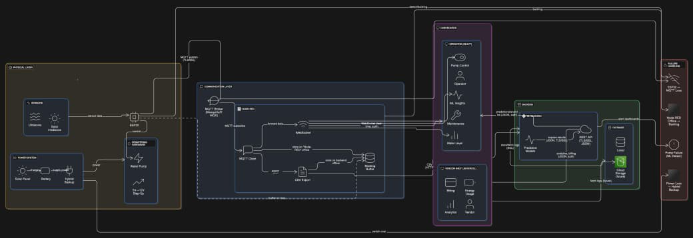
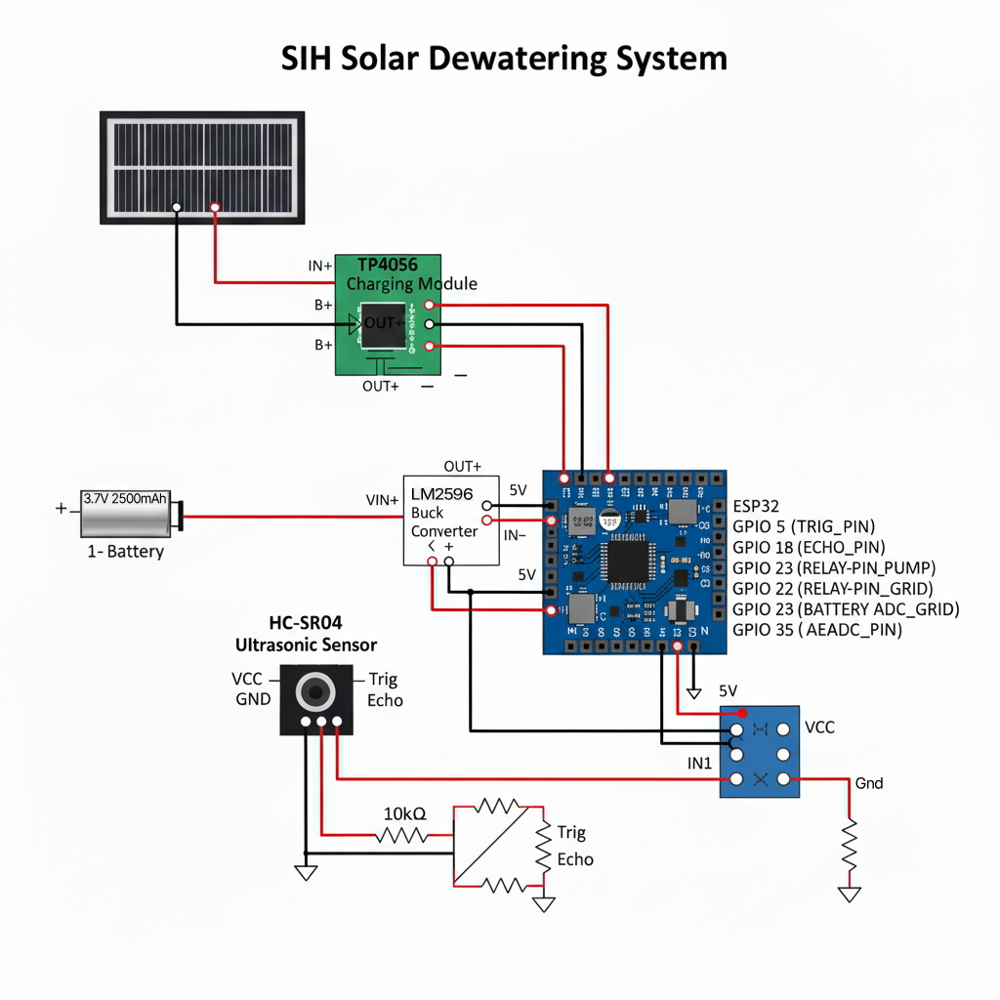
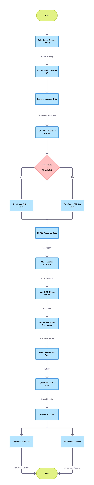

# 🌞 Solar Dewatering System using AI  

An **AI-powered IoT-based solar dewatering system** integrating **Next.js, React.js, ESP32, Node-RED, MQTT, and AI models** for **real-time monitoring, predictive analytics, and vendor/operational dashboards**.  

---

## 📂 Project Structure  

```
├── ├── LICENSE
├── ├── README.md
├── ├── docs
├── │ ├── architecture.png
├── │ └── screenshots
├── │ └── README.md
├── ├── hardware
├── │ ├── esp32-code
├── │ │ └── main.ino
├── │ └── node-red-dashboard
├── │ └── solar_flow.json
├── └── software
├── ├── Operational Dashboard
├── │ ├── README.md
├── │ ├── index.html
├── │ ├── node-red-flow.json
├── │ ├── package.json
├── │ ├── postcss.config.js
├── │ ├── src
├── │ │ ├── App.jsx
├── │ │ ├── components
├── │ │ │ ├── AIStatus.jsx
├── │ │ │ ├── Card.jsx
├── │ │ │ ├── ConnectionStatus.jsx
├── │ │ │ ├── IconBox.jsx
├── │ │ │ ├── Metrics.jsx
├── │ │ │ ├── MiniStatistics.jsx
├── │ │ │ ├── PumpControl.jsx
├── │ │ │ ├── SolarChart.jsx
├── │ │ │ ├── ThemeToggle.jsx
├── │ │ │ ├── WaterGauge.jsx
├── │ │ │ └── Weather.jsx
├── │ │ ├── index.css
├── │ │ ├── main.jsx
├── │ │ └── theme
├── │ │ ├── additions
├── │ │ │ └── card
├── │ │ │ └── card.js
├── │ │ ├── components
├── │ │ │ ├── badge.js
├── │ │ │ ├── button.js
├── │ │ │ ├── input.js
├── │ │ │ ├── link.js
├── │ │ │ ├── progress.js
├── │ │ │ ├── slider.js
├── │ │ │ ├── switch.js
├── │ │ │ └── textarea.js
├── │ │ ├── foundations
├── │ │ │ └── breakpoints.js
├── │ │ ├── styles.js
├── │ │ └── theme.js
├── │ └── tailwind.config.js
├── ├── README.md
├── ├── backend
├── │ ├── app
├── │ │ ├── init.py
├── │ │ ├── models
├── │ │ │ ├── init.py
├── │ │ │ └── ai_predictor.py
├── │ │ ├── routes
├── │ │ │ ├── init.py
├── │ │ │ ├── enhanced_dashboard.py
├── │ │ │ └── pump_control.py
├── │ │ └── services
├── │ │ ├── init.py
├── │ │ ├── ai_model_service.py
├── │ │ └── mqtt_service.py
├── │ ├── config.py
├── │ ├── models
├── │ │ ├── aiModel.py
├── │ │ └── synthetic_solar_data_minute.csv
├── │ ├── pump_predictions (3).csv
├── │ ├── pump_simulated_predictions.csv
├── │ ├── requirements.txt
├── │ └── run.py
├── └── vendor-dashboard
├── ├── README.md
├── ├── app
├── │ ├── favicon.ico
├── │ ├── globals.css
├── │ ├── layout.js
├── │ └── page.js
├── ├── eslint.config.mjs
├── ├── jsconfig.json
├── ├── next.config.mjs
├── ├── package.json
└── └── postcss.config.mjs  
```

---

## ⚙️ Features  

- **Vendor Dashboard (Next.js)**  
  - Vendor-focused analytics (energy cost, efficiency, ROI).  
  - Simple UI for high-level monitoring.  

- **Operational Dashboard (React.js)**  
  - Real-time solar + pump monitoring.  
  - AI status, pump control, water gauge, and weather.  

- **AI Model (Python)**  
  - Predicts pump operations from synthetic + live data.  
  - Exposed via REST APIs.  

- **IoT Hardware (ESP32 + MQTT + Node-RED)**  
  - ESP32 collects sensor data (voltage, current, water level).  
  - MQTT broker (Mosquitto in Docker) for messaging.  
  - Node-RED dashboard for system flow visualization.  

---

## 🚀 Getting Started  

### 1. Clone Repo  
```bash
git clone https://github.com/your-username/solar-dewatering-system.git
cd solar-dewatering-system
```
### 2. Backend Setup
```bash
cd software/backend
pip install -r requirements.txt
python run.py
```
### 3. Operational Dashboard (React.js)
```bash
cd software/Operational\ Dashboard
npm install
npm run dev
```
### 4. Vendor Dashboard (Next.js)
```bash
cd software/vendor-dashboard
npm install
npm run dev
```
### 5. MQTT Broker
```bash
cd hardware/mqtt-broker
docker-compose up -d
```
## 6. ESP32 Setup  

- Open `hardware/esp32-code/main.ino` in **Arduino IDE** or **PlatformIO**.  
- Configure Wi-Fi + MQTT credentials.  
- Flash code to ESP32.  

---

## 7. Node-RED Dashboard  

- Open **Node-RED** → Import → `solar_flow.json`.  
- Access dashboard at: [http://localhost:1880/ui](http://localhost:1880/ui).  

---

## 📊 System Architecture  





---

## 🔄 Workflow    

  

---

## 🎥 Demo & Presentation  

- **Video Demo** → [Add Link Here]   
- **Presentation** → [Download the presentation](https://github.com/tantanthecodeman/sih-solar-dewatering-system/raw/main/SIH_BrainDraft_072.pptx)

---


## 👥 Contributors  

- Ananya V  
- S Dhruv  
- Pulkit Raj  
- Ronit Shrivastava  
- Sahil Sinha   
- Tanay Gujarathi
