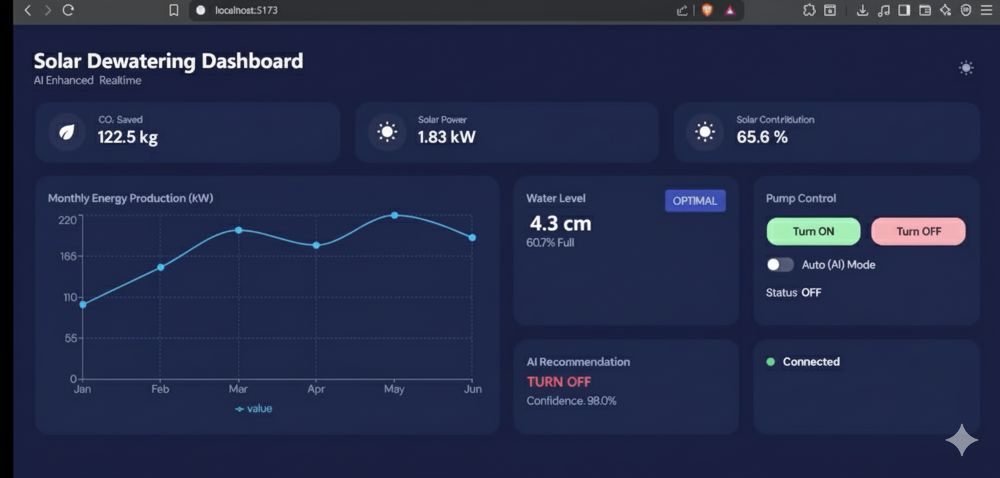

# 🌞 Solar Dewatering Operational Dashboard (React + Node-RED + MQTT)

An **AI-enhanced, real-time monitoring and control dashboard** for solar-powered dewatering systems.  
Built with **React + Chakra UI + WebSockets (MQTT bridge)**, it integrates **IoT sensors, AI predictions, and solar analytics** into one clean operational view.

---
<p align="center">
  
</p>

---

## ⚡ Features

- Real-time water level monitoring (ESP32 + ultrasonic sensor).
- AI-powered pump control recommendations with confidence scoring.
- Manual + Auto (AI) pump control modes.
- Solar production and CO₂ savings tracking.
- Weather data integration (temperature, humidity, irradiance, rainfall).
- Responsive, dark/light theme toggle.
- Modular components for easy scaling.

---

## 🚀 Quick Start

1. **Extract the folder.**
2. Open `src/App.jsx` and replace `<YOUR_PC_IP>` with your **machine IP** where Node-RED is running:
   ```js
   const WS_URL = "ws://<Your IP Address>:1880/mqtt"
   const API_URL = "http://<Your IP Address>:5000/api/status"
3. **Install dependencies:**
```bash
npm install
```
4. **Run dev server:**
```bash
npm run dev
```
4. **Run dev server:**
Open URL printed by Vite (e.g. http://localhost:5173
) in your browser.

## 🔌 Node-RED WebSocket Bridge

A sample Node-RED flow JSON (`node-red-flow.json`) is included.  
It creates a **WebSocket endpoint** `/mqtt` that bridges messages between your React frontend and a real MQTT broker.

- **Frontend connects to:**  
ws://<NODE_RED_IP>:1880/mqtt
- **Message forwarding:**  
- `mine/sensors` → **broker → frontend**  
- **WebSocket pump control messages** → broker topic `mine/pump/control`
### 🚀 Import Flow
1. Open Node-RED  
2. Click **Menu → Import → Clipboard**  
3. Paste the JSON from `solar_flow.json`  
4. Deploy the flow ✅
