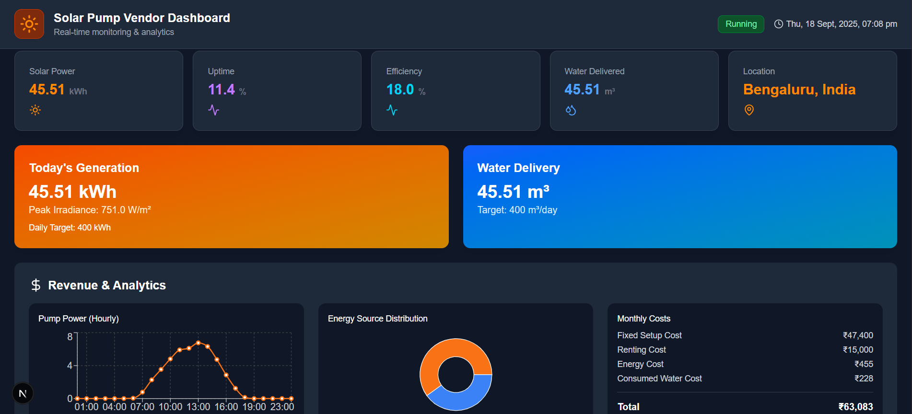

# 🌞 Solar Pump Vendor Dashboard

<p align="center">
  
</p>

A **Next.js-powered operational dashboard** for monitoring **solar pump performance, water delivery, and operational costs**.  
It integrates **real-time weather & irradiance data** via the **Open-Meteo API** and provides actionable insights for vendors.

---

## 📌 Overview

Vendors managing solar-powered pumps need **real-time insights** into how much energy is generated, water is delivered, and what the operational costs are.  
This dashboard provides:

- **Live monitoring** of solar generation & pump output  
- **Cost breakdowns** for energy, water, and setup  
- **Forecasting input** using **Open-Meteo solar irradiance data**  
- **Analytics visualizations** with charts & KPIs  

---

## 🚀 Quick Start

### 1. Install dependencies
```bash
npm install
```
### 2. Run development server
```bash
npm run dev
```
### 3. Open dashboard:
Visit → http://localhost:3000

## 🛠️ Tech Stack

This project leverages a modern web development stack for real-time monitoring and control:

- **[Next.js 13](https://nextjs.org/)** (App Router) → Server-side rendering, routing, and optimized build system.  
- **[React](https://react.dev/)** → Component-based UI, hooks for state management, and efficient reactivity.  
- **[Tailwind CSS](https://tailwindcss.com/)** → Utility-first styling for responsive and clean design.  
- **[Recharts](https://recharts.org/en-US/)** → Interactive data visualizations including line charts, gauges, and pie charts.  
- **[Lucide-react](https://lucide.dev/)** → Lightweight and modern icon library for UI elements.  
- **[Open-Meteo API](https://open-meteo.com/)** → Provides live weather and solar irradiance data integrated into the dashboard.  

## 🔌 External API Used

### 🌍 Open-Meteo API
We use the **[Open-Meteo API](https://open-meteo.com/)** (free, no API key required) to fetch live **solar and environmental conditions** for the dashboard.

**Endpoint Example:**
https://api.open-meteo.com/v1/forecast

```arduino
?latitude=12.9716
&longitude=77.5946
&hourly=direct_radiation,global_tilted_irradiance,temperature_2m,cloud_cover
&timezone=auto
```

**Parameters Used:**
- `direct_radiation` → Direct beam radiation (W/m²)  
- `global_tilted_irradiance` → Irradiance adjusted for panel tilt (W/m²)  
- `temperature_2m` → Air temperature (°C)  
- `cloud_cover` → Cloud coverage (%)  

## 📊 Dashboard Features

### 1. Header
- Title + project branding  
- Real-time clock (IST timezone)  
- Pump status badge → **Running / Idle / Error**  

### 2. Status Cards
- **Solar Power Generated (kWh)**  
- **Uptime %** → vs. daily water target  
- **Efficiency %** → actual vs. theoretical max  
- **Water Delivered (m³)**  
- **Location** → Configurable (Bengaluru by default)  

### 3. Energy & Water
- **Daily solar generation**  
- **Peak irradiance (W/m²)**  
- **Water delivery (m³)** vs. target  

### 4. Analytics & Revenue
- **Line Chart** → Pump hourly power output  
- **Pie Chart** → Energy source split (Solar vs Backup)  
- **Cost Breakdown** → Fixed setup, renting, energy, water  

## ⚙️ Configuration
Edit values in `app/page.js`:
```js
// Location (default = Bengaluru, India)
const latitude = 12.9716;
const longitude = 77.5946;

// Solar panel setup
const panelArea = 50;       // m²
const panelEfficiency = 0.18; // 18%

// Water pump
const pumpFlowRate = 1;     // m³ per kWh
const waterTarget = 400;    // Daily target (m³)

// Costs
const energyCostPerKWh = 10;     // ₹ per kWh
const waterCostPerCubicM = 5;    // ₹ per m³
const fixedSetupCost = 47400;    // ₹
const rentingCost = 15000;       // ₹
```